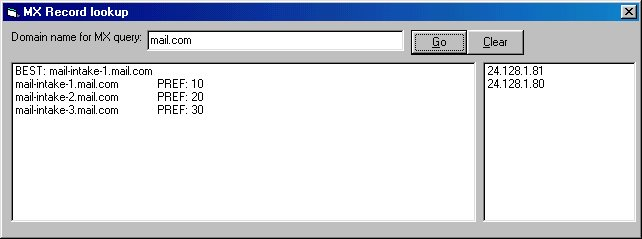



## MX Lookup Control \(UserControl\)

### Description

This is used to get the MX records of a host. This is a usercontrol, with a demo project. It has a ton of good code. Including how to get the DNS of your local machine in code in every possible way (there are many). So the control can find the dns itself.

This code has code from Jason Martin (http://www.planetsourcecode.com/xq/ASP/txtCodeId.11006/lngWId.1/qx/vb/scripts/ShowCode.htm)
 
### More Info
 
host, ie: mail.com

MX host, ie: intake-1.mail.com

             |
---                |---
**Submitted On**   |2000-09-06 13:10:04
**By**             |[Gregg Housh](https://github.com/Planet-Source-Code/PSCIndex/blob/master/ByAuthor/gregg-housh.md)
**Level**          |Intermediate
**User Rating**    |3.4 (17 globes from 5 users)
**Compatibility**  |VB 5\.0, VB 6\.0
**Category**       |[Custom Controls/ Forms/  Menus](https://github.com/Planet-Source-Code/PSCIndex/blob/master/ByCategory/custom-controls-forms-menus__1-4.md)
**World**          |[Visual Basic](https://github.com/Planet-Source-Code/PSCIndex/blob/master/ByWorld/visual-basic.md)
**Archive File**   |[CODE\_UPLOAD9687962000\.zip](https://github.com/Planet-Source-Code/gregg-housh-mx-lookup-control-usercontrol__1-11306/archive/master.zip)

### API Declarations

in the zip

